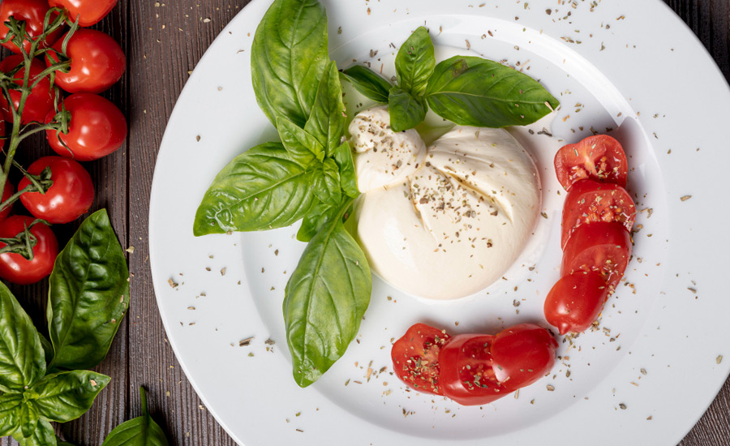

bufala.nvim
===========



Bufala is a simple Neovim plugin that makes working with buffer windows easier.
It pulls out the "tiling window manager for buffers" concept from my 
[dbm.nvim](https://github.com/nat-418/dbm.nvim) plugin and refines it,
shipping only one command:

* `:Bufala {subcommand} {arguments...}`

There are a few subcommands:

* `{count} cycle` moves through buffers with an optional count.
* `focus` swaps the current buffer with the first or main buffer window.
* `split {direction} {target}` opens a new split with an optional
  direction and target. Valid directions are up, down, left, and right.
  If no direction is given, Bufala will either abort or split based on
  the `layout` configured in the `setup` function (see below).
  The target is whatever you would put in a `:buffer {target}` command.
* `swap` swaps the current buffer window with last buffer window you were in.

Installation
------------

Using [Packer](https://github.com/wbthomason/packer.nvim):
```lua
use({
  'https://github.com/nat-418/bufala.nvim',
  config = function()
    require('bufala').setup({
      layout = 'stack' -- optional, valid values are 'stack' and 'row'
    })
  end
})
```

Configuration
-------------

Bufala allows for the optional configuration of a default layout for windows
and splits in the `setup` function. These layouts are clones from suckless'
[dwm](https://dwm.suckless.org/). If you prefer the manual approach to
getting everything just right, using sessions, etc. you might not care
to use a layout. The layouts work well for cases where you want a more
fluid, dynamic experience and not really think about where things need
to go.

Currently implemented layouts are:

* `stack`, a "portrait" optimized layout:
  ```
           | Buffer 2
  Buffer 1 +--------
           | Buffer 2
  ```

* `row`, a "landscape" optimized layout:
  ```
         Buffer 1
  ---------+---------
  Buffer 2 | Buffer 3 
  ```

See also
--------

* [tabbot.nvim](https://github.com/nat-418/tabbot.nvim) to use tabs as something
  similar to virtual desktops or workspaces.
